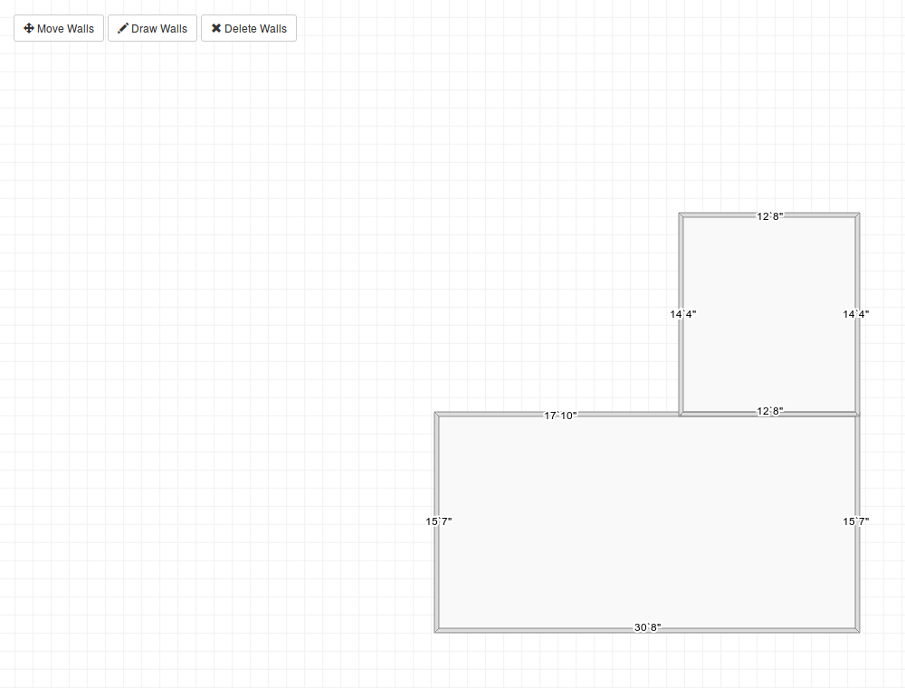
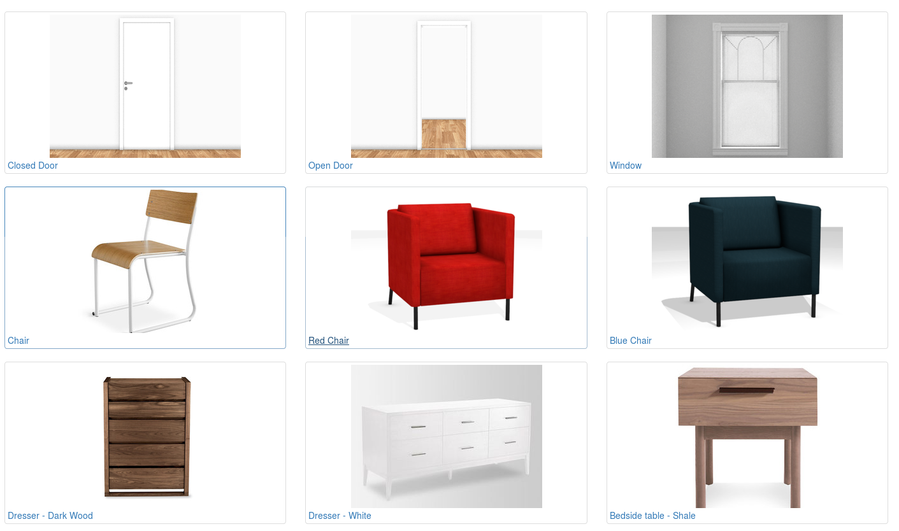
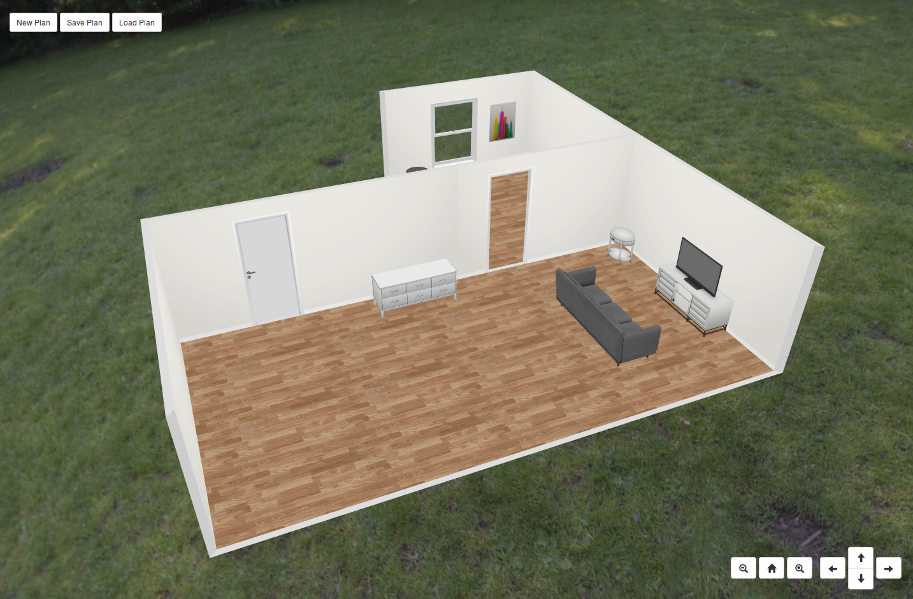

# README #
This is a javascript floorplanner tool based on the existing typescript based project [blueprint3d](https://github.com/furnishup/blueprint3d)

## DEMO ##

[Cick for example](https://aalavandhaann.github.io/blueprint-js/build)

## DOCS ##
Yes, the initiative has begun for the documentation. Of late I have been getting inquiries on using this framework. It is time to have the documentation rolling
[docs](https://aalavandhaann.github.io/blueprint-js/docs). Look at [wiki](https://github.com/aalavandhaann/blueprint-js/wiki) for some basic integration tips and information. 

## DEMO VR ##
The ability to export the floorplan as GLTF gives the scope of having easy VR with A-Frame. Export the layout to use it directly with A-Frame or process it further using Blender and then use it with A-Frame.

[Cick for example of VR - 1](https://aalavandhaann.github.io/blueprint-js/build/vrtest)
[VR - 2](https://aalavandhaann.github.io/blueprint-js/build/vrtest/minimal.html)

You will notice a lot of flickering in the VR mode. This is because of the overlapping materials in the floorplan.

## What is this?

This is a customizable application built on three.js that allows users to design an interior space such as a home or apartment. Below are screenshots from our Example App (link above).

1) Create 2D floorplan:



2) Add items:



3) Design in 3D:



## Developing and Running Locally

To get started, clone the repository and ensure you npm >= 3 and rollup installed, then run:

    npm install
    rollup -c

The latter command generates `build/js/bp3djs.js` from `src`. 

```
NODE_ENV=production rollup -c
```

The above command will generate `build/js/bp3djs.min.js` a minified and uglified version of the js. The easiest way to run locally is by

```
     rollup -c -w
```
Then, visit `http://localhost:10001` in your browser.

## Contribute!

This project and the [original project](https://github.com/furnishup/blueprint3d) requires a lot more work. If you are someone like yodha of typescript then kindly visit the original project, the author is a wonderful human being who facilitated this idea, efforts, and materials in the first place. Else you are someone like me who likes to play around with es6 then you can use this one.

Please contact us if you are interested in contributing.

### Todos and hurrays on completed ones

- More complete documentation of classes (This is necessary and must do for others to contribute)
- Make it easier to build a complete application using blueprint3d (cleaner API, more inclusive base, easier integration with a backend)
- Better serialization format for saving/loading "designs"
- JQuery is not used at all, instead I used the eventdispatcher from threejs (hurray)
- Better use of npm conventions and packaging
- Various bug fixes  (hurray for items that are stuck and don't move)
- refactor three/*
- update to current threejs  (hurray)
- introduce a more formal persistency format
- put all relevant settings into Core.Configuration to make them read-/writeable, User settings?
- complete type docs for all entities
- there're a few TODO_Ekki's left, kill them all (let me know Yodha)

## Directory Structure

### `src/` Directory

The `src` directory contains the core of the project. Here is a description of the various sub-directories:

`core` - Basic utilities such as logging and generic functions

`floorplanner` - 2D view/controller for editing the floorplan

`items` - Various types of items that can go in rooms

`model` - Data model representing both the 2D floorplan and all of the items in it

`three` - 3D view/controller for viewing and modifying item placement

## Notes about changes from the original
- Adding routines to modify the skybox images as environment (a crude implementation)
- Otherwise the api is ditto and the same
- Adding a BoxHelper to show selected states of items
